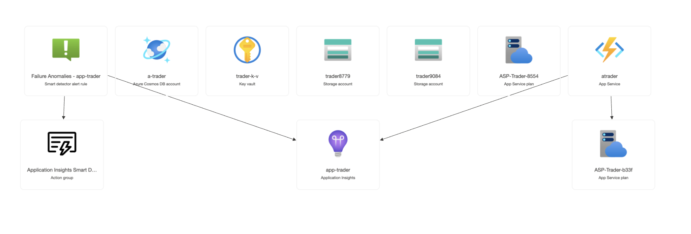

# Auto Trader

This project is a Python-based auto trading system that utilizes the Bybit API for real-time trading operations. The system is deployed on Microsoft Azure to ensure high availability, scalability, and efficient monitoring. Below is an architecture diagram that illustrates the main components and their relationships within the system.

## Key Components
1. App Service (atrader): Hosts the auto trading logic and interacts with the Bybit API.
2. Azure Cosmos DB: Stores trading data, configurations, and logs for easy retrieval and scalability.
3. Azure Key Vault: Securely manages sensitive information such as API keys and credentials.
